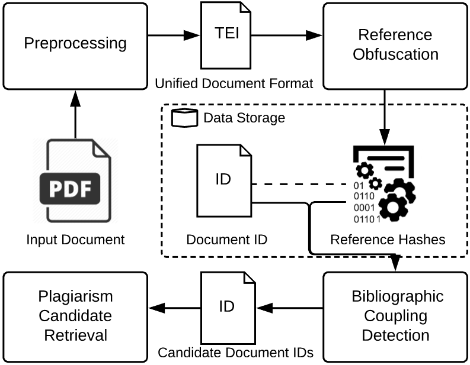

# CPPD DATA
This repository contains the data and code to reproduce the experiments in our papers on Content Protecting Plagiarism Detection. 

### CPPD Overview:

   

## Cases
The retracted papers and their sources can be optained from https://github.com/ag-gipp/hyplag-data (user: hyplag-guest | pw: hybridPD). For more information on this dataset, please consult the [project page](https://purl.org/hybridPD)

## Document Collection
We embedded our test cases in the collection of the NTCIR-12 MathIR Task. For research purposes, the dataset is available free of charge [here](http://research.nii.ac.jp/ntcir/permission/ntcir-12/perm-en-MathIR.html).

For your convinence, we preprocessed the dataset and extracted the hashes of the references used for the experiments described in the paper to the directory [evaluation](/evaluation). There are three csv-files which can be imported to any relational database system. The [readme](/evaluation/README.md) in that folder contains specific instructions on how to import the documents to mysql ,i.e., maria db 10, running on docker.
